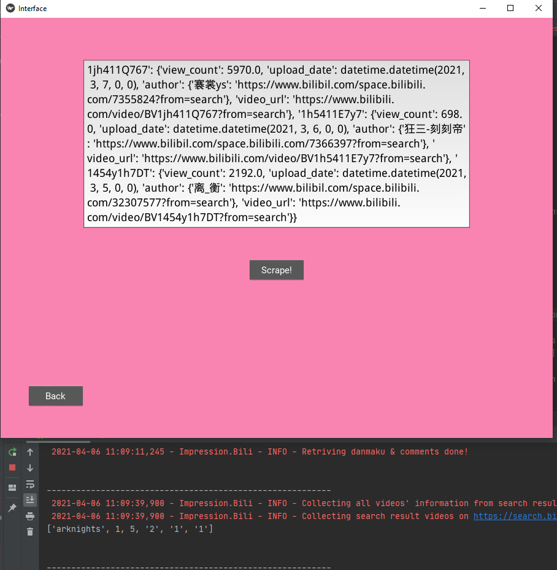

# Bili-impression Manual Test
This test is used to check the correctness of functionalities of GUI of the local application

## System Requirements

#### OS:
The following OS are appropriate system for running the UNO application and testing.
- Windows 7 or above
- Mac OS X
- Linux

#### Testing Prerequisites:
Software used for testing
- Pycharm2020.2 or above
- Libraries: see requirements.txt in root directory

## Scenes for testing

## 1. Main Screen

#### Test1.1
- test content:
    change the size of the window to see if components can automatically adjust positons.
- expect result: 
    components in screen can adjust their positions and scales to fit in new window
- result:
    success

#### Test1.2
- test content:
    check if all text input works correctly and can receive user input
- expect result: 
    user can input single-line string in one-line text input and multiline input in text boxes
- result:
    success

#### Test1.3
- test content:
    check if instruction button can navigate the screen to instruction page
- expect result: 
    by clicking the instruction button on the left bottom, screen shift to instruction page
- result:
    success

#### Test1.4
- test content:
    check if rank order option buttons can set the rankOpt variable successfully
- expect result: 
    after user click the button, rankOpt variable will be set to corresponding value
- result:
    success

#### Test1.5
- test content:
    check if search button works correctly:
- expect result: 
    after user click the button, the screen will be navigate to scraping page
- result:
    success

## 2.Instruction Page

#### Test2.1
- test content: 
    check if the instructions shows up correctly
- expect result: 
    instructions shows inside the text box in the middle of the screen.
- result:
    success

#### Test2.2
- test content: 
    check if the back button works correctly
- expect result: 
    after user click the back button, screen will be navigate to main screen
- result:
    success

## 3.Scraping Screen

#### Test3.1
- test content: 
    check if the scrape button works correctly
- expect result: 
    after user click scrape button, scraping program will be activate with options gain from main screen, and the result of scraping will be shown in this page's text box
- result:
    success

#### Test3.2
- test content: 
    check if the back button works correctly
- expect result: 
    after user click the back button, screen will be navigate to main screen
- result:
    success
