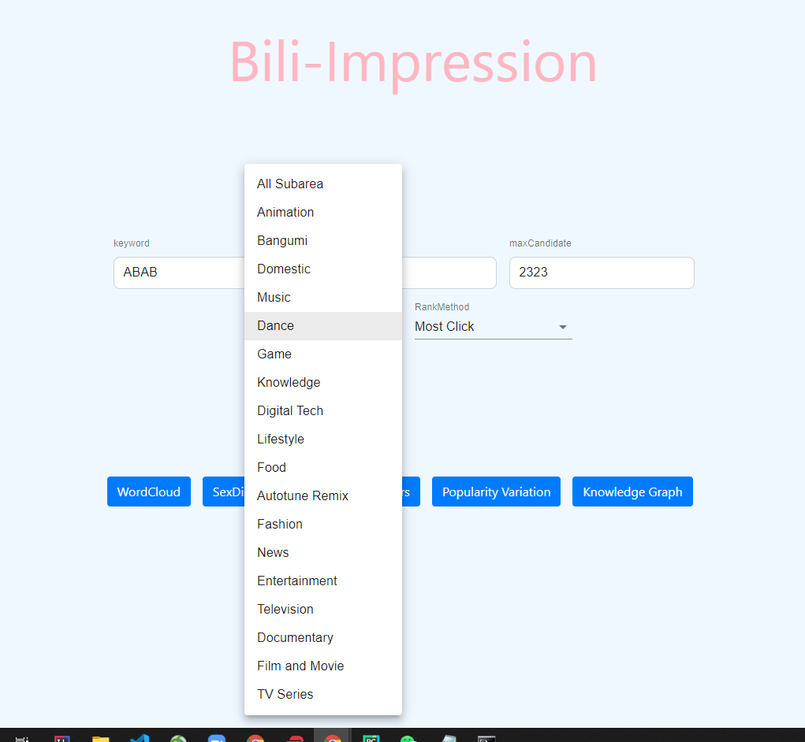

# Bili-impression Manual Test part2
This test is used to check the correctness of functionalities of Webpage frontend of the web application

## System Requirements

#### OS:
The following OS are appropriate system for running the UNO application and testing.
- Windows 7 or above
- Mac OS X
- Linux

#### Testing Prerequisites:
Software used for testing
- Pycharm2020.2 or above
- Libraries: see requirements.txt in root directory

## Scenes for testing

## 1. Main Screen

#### Test1.1
- test content:
    access webpage from browser and the webpage renders successfully
- expect result: 
    components in screen are rendered as planned
- result:
    success

#### Test1.2
- test content:
    check if all text input works correctly and can receive user input
- expect result: 
    user can input single-line string in one-line text input and multiline input in text boxes
- result:
    success

#### Test1.3
- test content:
    check if option box works correctly
- expect result: 
    user can choose corresponding options for rank method and subarea of videos
- result:
    success

#### Test1.4
- test content:
    check if 5 buttons at the bottom of the webpage can navigate to correct pages
- expect result: 
    by clicking the buttons, page will be correctly redirected
- result:
    success

#### Test1.5
- test content:
    check if the options of searching can be carried to new page after navigation
- expect result: 
    details info of search options given by user can be shown in a new page
- result:
    success
